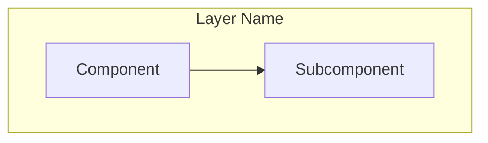
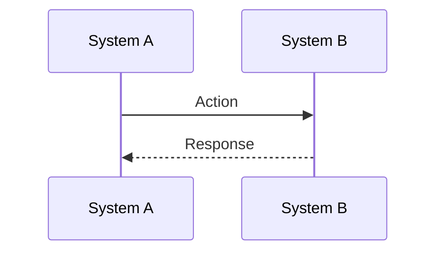

# Tech Writer Agent Memory

## Documentation Structure Patterns

### Location Strategy
- **Architecture docs** (`docs/architecture/`): Conceptual, design decisions, comparisons, diagrams
- **Operations docs** (`docs/operations/`): How-to guides, CLI references, troubleshooting
- **ADRs** (`docs/architecture/adr/`): Decision records with YYYYMMDD-short-title format
- **Component docs** (`infra/*/README.md`): Component-specific setup and usage

### Content Organization
- Start with Table of Contents for docs >500 lines
- Use "For X users" in audience targeting (e.g., "For S3 users")
- Include "Last Updated" timestamp at top
- Link to related docs in "Next Steps" or "References" section

## Mermaid Diagram Patterns

### Architecture Diagrams
Use `graph TB` (top-bottom) for hierarchical structures:

### Flow Diagrams
Use `flowchart LR` for linear processes, `sequenceDiagram` for interactions:

### Comparison Matrices
Use tables with visual indicators:
- ✅ for advantages
- ❌ for disadvantages
- 📊 for metrics

## Common Terminology (dtheinfra)

### Storage Concepts
- **Warehouse**: Root GCS path (`gs://bucket/warehouse/`)
- **Medallion Architecture**: Bronze (raw) → Silver (cleaned) → Gold (aggregated)
- **Iceberg Table**: Consists of `metadata/` + `data/` directories
- **Lakehouse**: Combines data lake (GCS) + data warehouse (Iceberg ACID)

### Tool Names
- **Lakekeeper**: Rust-based Iceberg REST catalog (use full name on first mention)
- **PyIceberg**: Python Iceberg SDK (not "py-iceberg" or "pyiceberg")
- **gsutil**: GCS CLI tool (lowercase, one word)
- **DataHub**: Metadata catalog (capital H)

### Authentication
- **Service Account (SA)**: GCP identity for applications
- **ADC**: Application Default Credentials (GCP auth method)
- **IAM**: Identity and Access Management (both AWS and GCP use this term)

## Documentation Quality Checklist

When writing technical docs, ensure:
- [ ] Visual diagram for every major concept (use Mermaid)
- [ ] Code examples are runnable (include full commands)
- [ ] Cross-references use absolute paths in docs, relative in code
- [ ] "Why" is explained, not just "how" and "what"
- [ ] Troubleshooting section for operational docs
- [ ] Comparison tables for alternatives (e.g., GCS vs S3)
- [ ] Cost analysis for architectural decisions
- [ ] Security best practices highlighted

## Writing Style Guidelines

### Tone
- Technical but approachable
- Use active voice ("Run this command" not "This command should be run")
- Avoid jargon without definition
- Include "why" context for non-obvious decisions

### Code Examples
- Show full commands (not `...` placeholders)
- Include expected output after commands
- Add comments for non-obvious flags
- Use realistic paths (`/Users/takudo/Documents/dtheinfra`, not `/path/to/project`)

### Comparison Documentation
When comparing technologies (e.g., GCS vs S3):
1. Start with terminology mapping table
2. Show side-by-side code examples
3. Include CLI comparison table
4. Provide cost analysis with real numbers
5. Document trade-offs objectively

## Lessons Learned

### What Works Well
- **S3 as reference point**: Most readers know S3, so compare everything to it
- **Mermaid for flows**: Sequence diagrams clarify complex interactions
- **Real-world examples**: Use actual project paths and bucket names from dtheinfra
- **Troubleshooting checklists**: Bulleted list of things to verify
- **Cost tables**: Engineers care about $$$, show calculations

### Avoid
- Don't use emojis in docs (per CLAUDE.md guidelines) except in output examples
- Don't create docs proactively without request (per workflow rules)
- Don't use relative paths in documentation file links
- Don't assume S3 knowledge is universal (some readers are GCS-first)

## Project-Specific Conventions

### File Naming
- Architecture docs: `kebab-case.md` (e.g., `google-cloud-storage.md`)
- ADRs: `NNNN-kebab-case.md` (e.g., `0002-use-gcs-for-storage.md`)
- Component READMEs: Always `README.md` (uppercase)

### Code Block Languages
- Shell commands: `bash`
- Python: `python`
- JSON config: `json`
- YAML: `yaml`
- Properties: `properties`
- Mermaid: `mermaid`

### Cross-Referencing
- Absolute paths in generated docs for clarity
- Relative paths in existing infra docs (match project style)
- Link to related docs in "Next Steps" section
- Use descriptive link text, not "click here"

## Future Improvements

### Topics to Document
- Iceberg table lifecycle (compaction, snapshot expiration)
- DataHub lineage integration with OpenLineage
- Kubernetes deployment patterns
- CI/CD pipeline architecture
- Security model (service accounts, workload identity)

### Diagram Patterns to Add
- Entity-relationship diagrams for data models
- State diagrams for workflow processes
- Gantt charts for project timelines
- Class diagrams for object structures (when Python/Scala code docs added)
