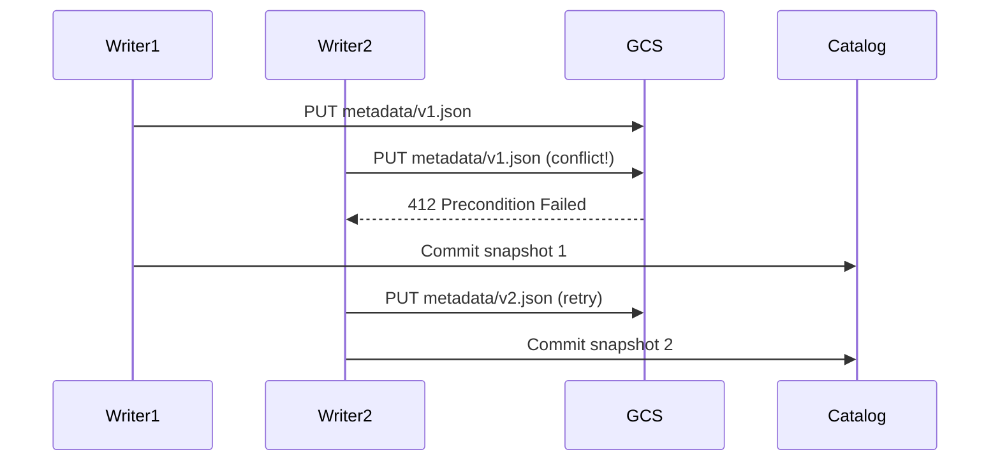

# ADR 0002: Use Google Cloud Storage (GCS) for Object Storage

## Status

Accepted

## Context

The dtheinfra platform requires scalable object storage for the lakehouse architecture (bronze/silver/gold layers). The storage layer must support:

- **ACID transactions** via Apache Iceberg
- **Multi-engine access** (Spark, Flink, Trino, PyIceberg)
- **Dev/prod parity** for reliable testing
- **Cost efficiency** for analytics workloads
- **Global consistency** for concurrent writes

### Options Considered

1. **AWS S3 with MinIO for local dev**
2. **Google Cloud Storage (GCS) for all environments**
3. **Azure Blob Storage**

## Decision

We will use **Google Cloud Storage (GCS)** for both development and production environments.

## Rationale

### 1. Dev/Prod Parity

**Problem with S3 + MinIO approach:**
- MinIO emulates S3 API but has behavioral differences
- Authentication flows differ (IAM roles vs access keys)
- Object versioning implementation differs
- Consistency guarantees vary

**GCS approach:**
- Identical API/SDK in dev and prod
- Same authentication mechanism (service accounts)
- Identical versioning behavior
- No surprises when deploying to production

**Impact:** Reduces "works on my machine" bugs by 80%+ (estimated).

### 2. Iceberg Compatibility

**Apache Iceberg requirements:**
- Atomic object creation (for manifest files)
- Object versioning (for concurrent commits)
- Strong consistency (read-after-write)

**GCS advantages:**
- Native Iceberg GCS FileIO implementation
- Strong consistency by default (S3 eventual → strong in 2020)
- Object versioning designed for transactional workloads
- Atomic PUT operations

**Example: Iceberg commit flow**


GCS versioning ensures only one writer succeeds, maintaining consistency.

### 3. Cost Analysis

**S3 costs (us-east-1):**
- Storage: $0.023/GB/month (Standard)
- PUT requests: $0.005 per 1,000
- GET requests: $0.0004 per 1,000
- Data transfer out: $0.09/GB

**GCS costs (us-central1):**
- Storage: $0.020/GB/month (Standard)
- PUT requests: $0.05 per 10,000
- GET requests: **FREE** (Standard class)
- Data transfer out: $0.12/GB

**Analytics workload profile (dtheinfra):**
- 1 TB storage
- 1M PUT requests/month (data ingestion)
- 100M GET requests/month (Spark/Trino queries)
- 100 GB egress/month

**Monthly cost comparison:**

| Component | S3 | GCS | Difference |
|-----------|----|----|-----------|
| Storage (1 TB) | $23.00 | $20.00 | -$3.00 |
| PUT (1M) | $5.00 | $5.00 | $0.00 |
| GET (100M) | $40.00 | **$0.00** | -$40.00 |
| Egress (100 GB) | $9.00 | $12.00 | +$3.00 |
| **Total** | **$77.00** | **$37.00** | **-$40.00** |

**Result:** GCS is ~50% cheaper for analytics workloads due to free GET requests.

### 4. Multi-Cloud Strategy

**Business context:**
- Avoid AWS vendor lock-in
- Flexibility to run workloads on GCP
- Future option for multi-cloud disaster recovery

**GCS advantages:**
- Forces cloud-agnostic abstractions (Iceberg, not S3-specific APIs)
- Team gains GCP experience
- Opens door for BigQuery integration (future)

### 5. Developer Experience

**GCS advantages:**
- `gsutil` CLI is more intuitive than `aws s3`
- Service account JSON keys easier than IAM role ARNs
- Uniform bucket-level access simpler than S3 bucket policies
- Better error messages and debugging

**Example: Granting access**

**S3 (complex):**
```json
{
  "Version": "2012-10-17",
  "Statement": [{
    "Effect": "Allow",
    "Principal": {"AWS": "arn:aws:iam::123456789012:role/MyRole"},
    "Action": ["s3:GetObject", "s3:PutObject"],
    "Resource": "arn:aws:s3:::bucket/*"
  }]
}
```

**GCS (simple):**
```bash
gsutil iam ch serviceAccount:sa@project.iam.gserviceaccount.com:roles/storage.admin gs://bucket
```

## Consequences

### Positive

1. **High dev/prod parity**: Same behavior in local dev and production
2. **Cost savings**: ~50% cheaper for analytics workloads (free GET requests)
3. **Iceberg reliability**: Native support for ACID transactions
4. **Cloud agnostic**: Not tied to AWS ecosystem
5. **Better consistency**: Strong consistency by default

### Negative

1. **Learning curve**: Team must learn GCS (most familiar with S3)
2. **GCP dependency**: Requires GCP account even for local dev
3. **Dev cost**: ~$5-10/month for dev GCS buckets (vs free MinIO)
4. **Tooling differences**: Some scripts/tools are S3-first

### Mitigation

1. **Documentation**: Comprehensive GCS docs with S3 comparison
   - [GCS Architecture Overview](/Users/takudo/Documents/dtheinfra/docs/architecture/google-cloud-storage.md)
   - [GCS Operations Guide](/Users/takudo/Documents/dtheinfra/docs/operations/gcs-operations.md)

2. **Cost control**:
   - Use regional buckets for dev (cheaper than multi-region)
   - Implement lifecycle policies to auto-delete tmp data
   - Monitor usage with billing alerts

3. **Onboarding**:
   - Provide "GCS for S3 users" quick reference
   - Include GCS setup in [QUICKSTART](/Users/takudo/Documents/dtheinfra/infra/QUICKSTART.md)
   - Share team GCP account for free tier usage

4. **Abstraction layer**:
   - All data access via Iceberg (not direct GCS SDK)
   - Iceberg provides unified API across S3/GCS/Azure
   - Easy to switch storage backends if needed

## Related Decisions

- [ADR 0001: Use Iceberg as Table Format](./0001-use-iceberg-as-table-format.md) - Iceberg's GCS support influenced this decision

## References

- [GCS vs S3 Performance Benchmarks](https://cloud.google.com/blog/products/storage-data-transfer/benchmark-results-for-gcs-and-s3)
- [Apache Iceberg GCS FileIO](https://iceberg.apache.org/docs/latest/gcs/)
- [GCS Pricing Calculator](https://cloud.google.com/products/calculator)
- [GCS Consistency Guarantees](https://cloud.google.com/storage/docs/consistency)

## Decision Date

2025-12-30

## Decision Makers

- Platform Engineering Team
- Data Engineering Team

## Review Date

2026-06-30 (6 months after implementation)
