# GCS Visual Guide for dtheinfra

**Last Updated:** 2026-02-06

This document provides visual diagrams to understand how GCS integrates with the dtheinfra platform.

---

## GCS Architecture Overview

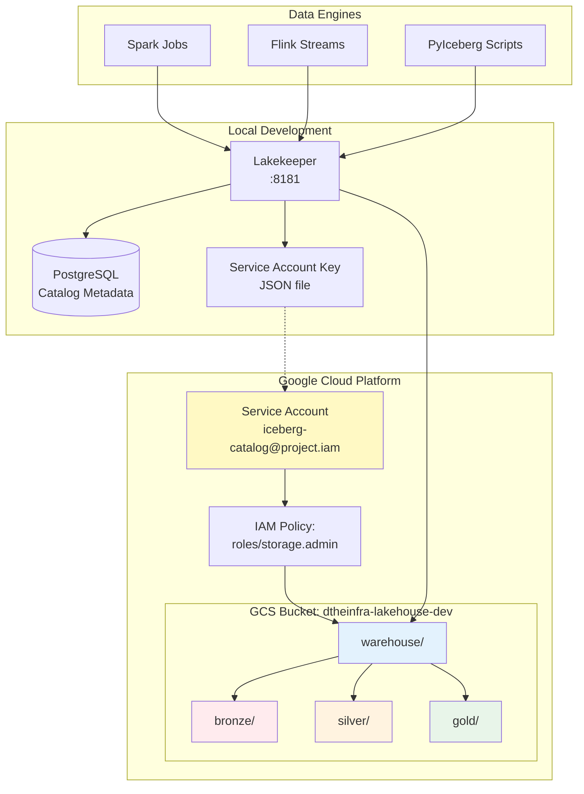

---

## Medallion Architecture with GCS

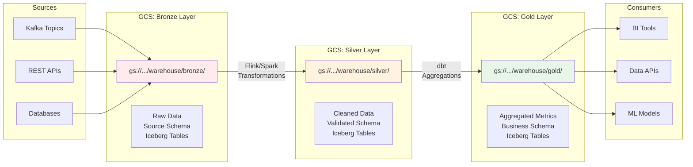

---

## Iceberg Table Structure on GCS

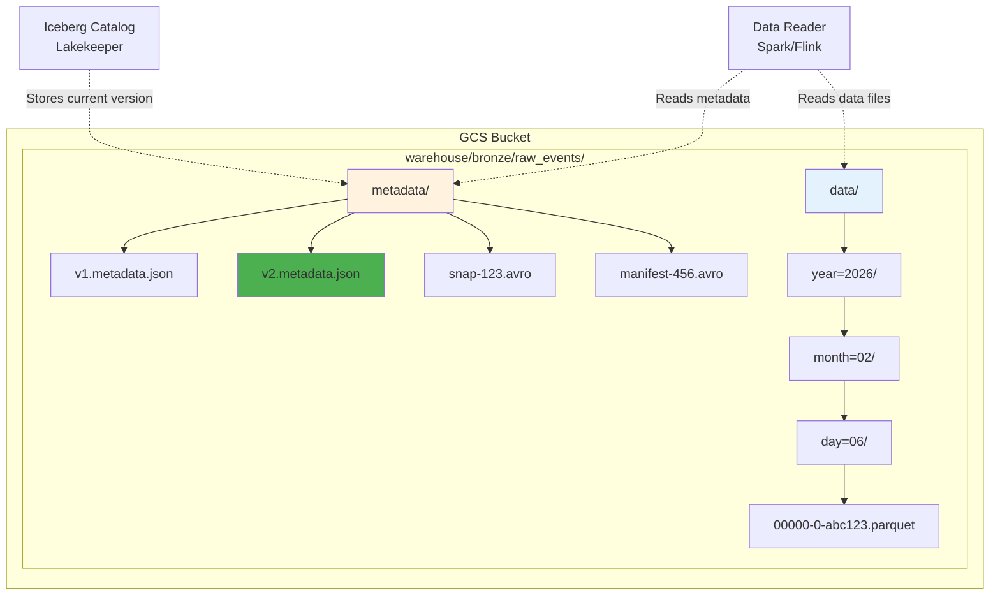

**Structure breakdown:**
- `metadata/` - Iceberg metadata files (JSON, Avro manifests)
- `data/` - Parquet data files organized by partition keys
- `vN.metadata.json` - Table schema, partitioning, snapshots
- `snap-*.avro` - Snapshot manifest list
- `manifest-*.avro` - File-level manifest with statistics

---

## Data Write Flow (Iceberg + GCS)

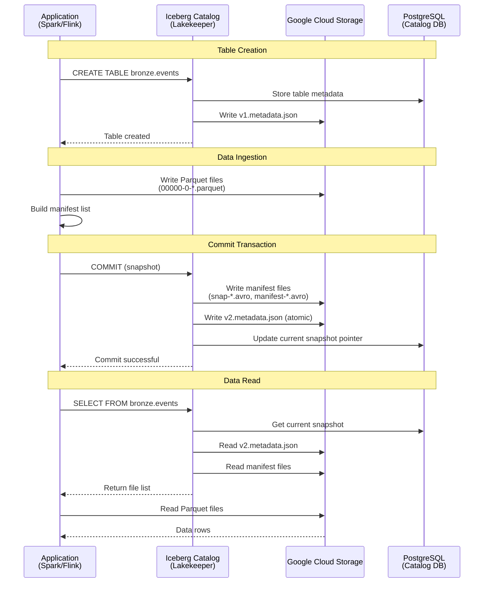

---

## Authentication Flow

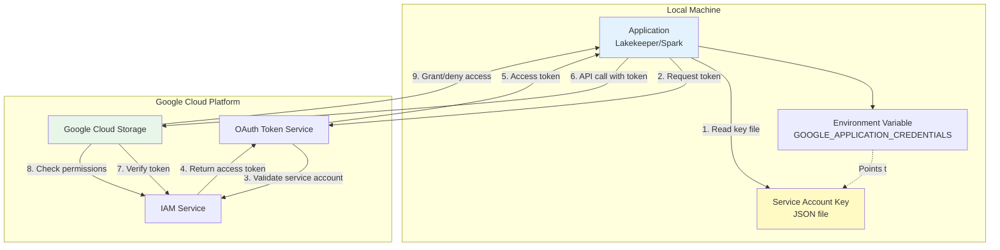

**Key points:**
1. Application reads service account key from file
2. Exchanges key for OAuth access token
3. Uses token for all GCS API calls
4. Token expires after 1 hour (auto-refreshed by SDK)

---

## Storage Class Lifecycle

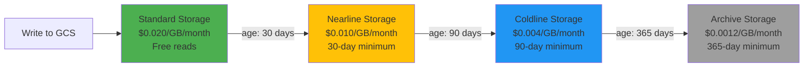

**Lifecycle policy example:**
```json
{
  "lifecycle": {
    "rule": [
      {
        "action": {"type": "SetStorageClass", "storageClass": "NEARLINE"},
        "condition": {"age": 30, "matchesPrefix": ["warehouse/bronze/"]}
      },
      {
        "action": {"type": "SetStorageClass", "storageClass": "COLDLINE"},
        "condition": {"age": 90, "matchesPrefix": ["warehouse/bronze/"]}
      }
    ]
  }
}
```

---

## GCS vs S3 Cost Comparison (Analytics Workload)

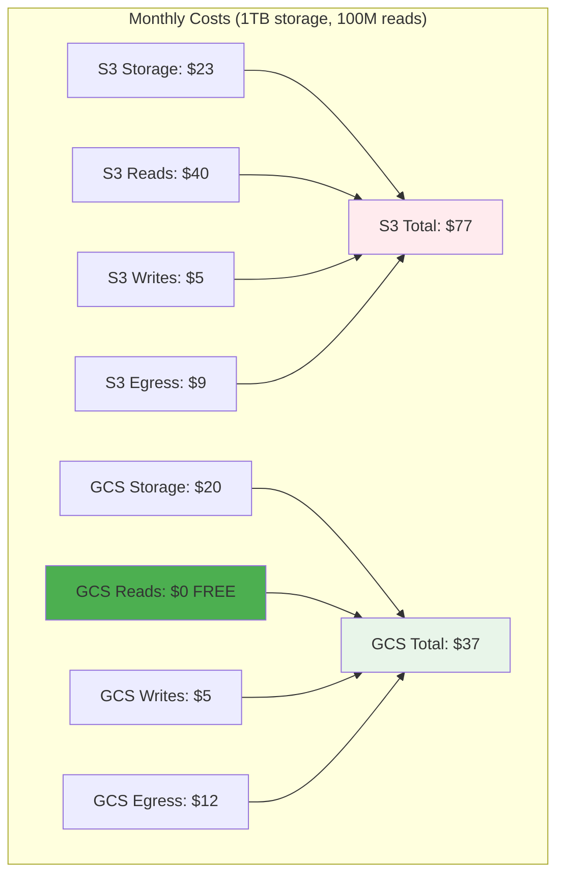

**Key insight:** GCS is 52% cheaper for analytics workloads due to FREE read operations.

---

## dtheinfra Network Architecture

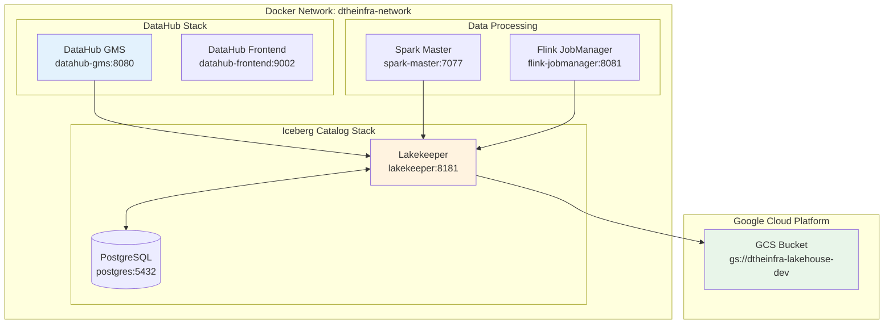

---

## Service Account Permissions Model

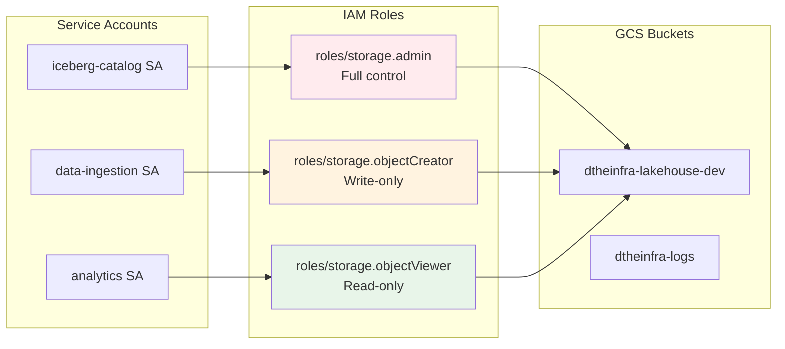

**Role assignments:**
- **Iceberg Catalog**: `storage.admin` (needs to manage metadata)
- **Data Ingestion**: `storage.objectCreator` (write-only for security)
- **Analytics Jobs**: `storage.objectViewer` (read-only for security)

---

## Bucket Organization Pattern

```
gs://dtheinfra-lakehouse-dev/
├── warehouse/                      # Iceberg warehouse root
│   ├── bronze/                     # Raw data layer
│   │   ├── raw_events/             # Iceberg table
│   │   │   ├── metadata/           # Table metadata
│   │   │   │   ├── v1.metadata.json
│   │   │   │   ├── v2.metadata.json
│   │   │   │   ├── snap-1234.avro
│   │   │   │   └── manifest-5678.avro
│   │   │   └── data/               # Parquet files
│   │   │       └── year=2026/
│   │   │           └── month=02/
│   │   │               └── 00000-0-abc.parquet
│   │   └── raw_users/              # Another table
│   │       └── ...
│   ├── silver/                     # Cleaned data layer
│   │   ├── cleaned_events/
│   │   └── enriched_users/
│   └── gold/                       # Aggregated data layer
│       ├── user_metrics/
│       └── daily_aggregations/
├── tmp/                            # Temporary files (auto-deleted)
└── backups/                        # Manual backups
```

**Lifecycle policies:**
- `warehouse/bronze/`: Transition to Nearline after 30 days
- `warehouse/silver/`: Keep in Standard
- `warehouse/gold/`: Keep in Standard
- `tmp/`: Delete after 7 days

---

## Query Performance Optimization

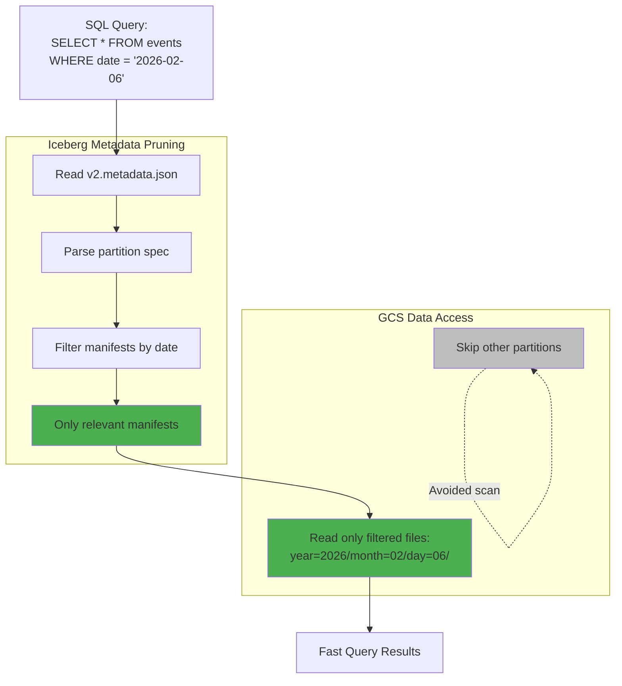

**Performance gains:**
- Iceberg metadata filtering avoids scanning irrelevant files
- GCS free reads on Standard class (no cost penalty for queries)
- Columnar Parquet format allows column pruning
- Result: 100x faster than full table scan

---

## Troubleshooting Decision Tree

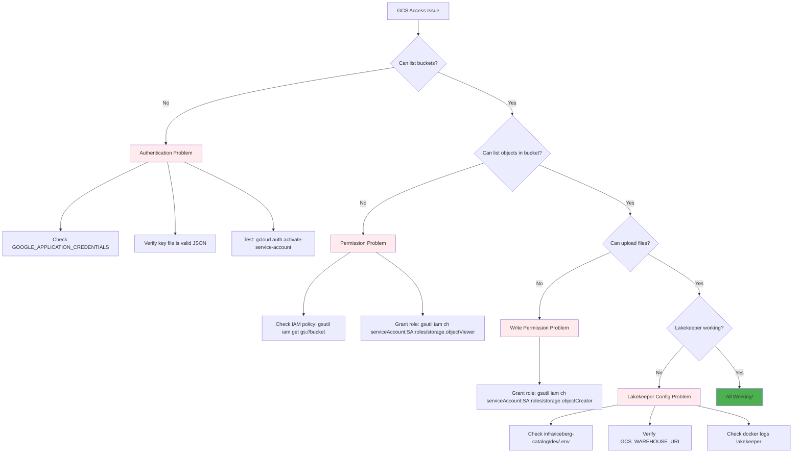

---

## Summary: Why GCS for dtheinfra?

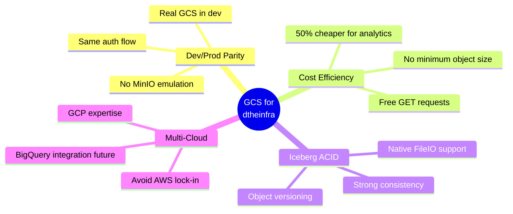

---

## Next Steps

For detailed information, see:
- [GCS Architecture Overview](./google-cloud-storage.md) - Comprehensive concepts and comparisons
- [GCS Operations Guide](../operations/gcs-operations.md) - Setup and CLI usage
- [GCS Quick Reference](../operations/gcs-quick-reference.md) - S3 to GCS translation
- [ADR 0002: Use GCS for Storage](./adr/0002-use-gcs-for-storage.md) - Decision rationale

---

**Legend for diagrams:**
- Bronze fill: Raw/bronze layer data
- Silver fill: Cleaned/silver layer data
- Gold fill: Aggregated/gold layer data
- Green fill: Successful/optimal state
- Red fill: Error/problem state
- Gray fill: Avoided/skipped operations
