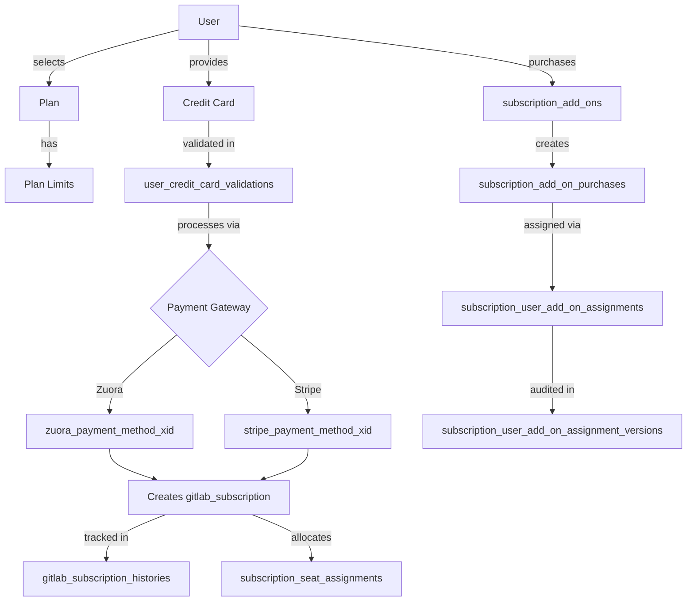

# Payment, Finance, and Transaction Schema

This document visualizes the relationships between all payment, finance, and transaction-related tables in the GitLab database schema.

## Entity Relationship Diagram

```mermaid
erDiagram
    %% Core Subscription Tables
    gitlab_subscriptions ||--o{ gitlab_subscription_histories : "has history"
    gitlab_subscriptions }o--|| plans : "hosted_plan_id"
    gitlab_subscriptions }o--|| namespaces : "namespace_id"
    
    %% Plan Configuration
    plans ||--|| plan_limits : "defines limits"
    
    %% Subscription Seats
    gitlab_subscriptions ||--o{ subscription_seat_assignments : "tracks seats"
    subscription_seat_assignments }o--|| users : "user_id"
    subscription_seat_assignments }o--|| namespaces : "namespace_id"
    subscription_seat_assignments }o--|| organizations : "organization_id"
    
    %% Add-on Purchases
    subscription_add_ons ||--o{ subscription_add_on_purchases : "can be purchased"
    subscription_add_on_purchases }o--|| namespaces : "namespace_id"
    subscription_add_on_purchases }o--|| organizations : "organization_id"
    subscription_add_on_purchases ||--o{ subscription_user_add_on_assignments : "assigned to users"
    
    %% Add-on Assignments
    subscription_user_add_on_assignments }o--|| users : "user_id"
    subscription_user_add_on_assignments }o--|| organizations : "organization_id"
    subscription_user_add_on_assignments ||--o{ subscription_user_add_on_assignment_versions : "has audit trail"
    
    %% Generic Subscriptions (notifications/features)
    subscriptions }o--|| users : "user_id"
    subscriptions }o--|| projects : "project_id"
    
    %% Payment Methods
    users ||--o| user_credit_card_validations : "has validated card"
    
    %% CI Subscriptions
    ci_subscriptions_projects }o--|| projects : "project_id"
    
    %% Integration Subscriptions
    jira_connect_subscriptions }o--|| namespaces : "namespace_id"
    
    %% Release Subscriptions
    activity_pub_releases_subscriptions }o--|| projects : "project_id"
    
    %% Table Definitions
    gitlab_subscriptions {
        bigint id PK
        timestamp created_at
        timestamp updated_at
        date start_date
        date end_date
        date trial_ends_on
        bigint namespace_id FK
        bigint hosted_plan_id FK
        integer max_seats_used
        integer seats
        integer seats_in_use
        integer seats_owed
        boolean trial
        boolean auto_renew
        date trial_starts_on
        smallint trial_extension_type
        timestamp max_seats_used_changed_at
        timestamp last_seat_refresh_at
        smallint hosted_plan_name_uid
    }
    
    gitlab_subscription_histories {
        bigint id PK
        bigint gitlab_subscription_id FK
        timestamp gitlab_subscription_created_at
        timestamp gitlab_subscription_updated_at
        timestamp created_at
        date start_date
        date end_date
        date trial_ends_on
        date trial_starts_on
        bigint namespace_id FK
        bigint hosted_plan_id FK
        integer max_seats_used
        integer seats
        integer seats_in_use
        boolean trial
        boolean auto_renew
        smallint change_type
        smallint trial_extension_type
        smallint hosted_plan_name_uid
    }
    
    plans {
        bigint id PK
        timestamp created_at
        timestamp updated_at
        varchar name
        varchar title
        smallint plan_name_uid
    }
    
    plan_limits {
        bigint id PK
        bigint plan_id FK
        integer ci_pipeline_size
        integer ci_active_jobs
        integer project_hooks
        integer group_hooks
        integer ci_project_subscriptions
        integer ci_pipeline_schedules
        integer offset_pagination_limit
        integer ci_instance_level_variables
        integer storage_size_limit
        integer ci_max_artifact_size_lsif
        integer ci_max_artifact_size_archive
        integer ci_max_artifact_size_metadata
        integer ci_max_artifact_size_trace
        integer ci_max_artifact_size_junit
        integer ci_max_artifact_size_sast
        integer ci_max_artifact_size_dependency_scanning
        integer ci_max_artifact_size_container_scanning
        integer ci_max_artifact_size_dast
    }
    
    subscription_add_ons {
        bigint id PK
        timestamp created_at
        timestamp updated_at
        smallint name
        text description
    }
    
    subscription_add_on_purchases {
        bigint id PK
        timestamp created_at
        timestamp updated_at
        bigint subscription_add_on_id FK
        bigint namespace_id FK
        bigint organization_id FK
        integer quantity
        date expires_on
        date started_at
        text purchase_xid
        boolean trial
        timestamp last_assigned_users_refreshed_at
    }
    
    subscription_seat_assignments {
        bigint id PK
        timestamp created_at
        timestamp updated_at
        bigint namespace_id FK
        bigint organization_id FK
        bigint user_id FK
        timestamp last_activity_on
        smallint seat_type
    }
    
    subscription_user_add_on_assignments {
        bigint id PK
        timestamp created_at
        timestamp updated_at
        bigint add_on_purchase_id FK
        bigint user_id FK
        bigint organization_id FK
    }
    
    subscription_user_add_on_assignment_versions {
        bigint id PK
        bigint organization_id FK
        bigint item_id
        bigint purchase_id
        bigint user_id
        timestamp created_at
        text item_type
        text event
        text namespace_path
        text add_on_name
        text whodunnit
        jsonb object
    }
    
    subscriptions {
        bigint id PK
        timestamp created_at
        timestamp updated_at
        bigint user_id FK
        bigint project_id FK
        bigint subscribable_id
        varchar subscribable_type
        boolean subscribed
    }
    
    user_credit_card_validations {
        bigint user_id PK_FK
        timestamp credit_card_validated_at
        text last_digits_hash
        text holder_name_hash
        text expiration_date_hash
        text network_hash
        text zuora_payment_method_xid
        text stripe_setup_intent_xid
        text stripe_payment_method_xid
        text stripe_card_fingerprint
    }
    
    ci_subscriptions_projects {
        bigint id PK
        bigint project_id FK
    }
    
    jira_connect_subscriptions {
        bigint id PK
        bigint namespace_id FK
    }
    
    activity_pub_releases_subscriptions {
        bigint id PK
        bigint project_id FK
    }
    
    %% External Reference Tables
    users {
        bigint id PK
    }
    
    namespaces {
        bigint id PK
    }
    
    organizations {
        bigint id PK
    }
    
    projects {
        bigint id PK
    }
```

## Key Relationships

### Core Subscription Flow
1. **`plans`** defines available subscription tiers (Free, Premium, Ultimate)
2. **`plan_limits`** specifies feature limits for each plan
3. **`gitlab_subscriptions`** represents active subscriptions linked to namespaces and plans
4. **`gitlab_subscription_histories`** tracks all changes to subscriptions over time

### Seat Management
- **`subscription_seat_assignments`** tracks which users occupy subscription seats
- Links to users, namespaces, and organizations
- Tracks last activity and seat type

### Add-on Purchases
1. **`subscription_add_ons`** catalog of available add-on products
2. **`subscription_add_on_purchases`** records purchases with quantity, expiration, and trial status
3. **`subscription_user_add_on_assignments`** assigns purchased add-ons to specific users
4. **`subscription_user_add_on_assignment_versions`** provides audit trail for assignments

### Payment Methods
- **`user_credit_card_validations`** stores PCI-compliant hashed credit card data
- Integrates with Zuora and Stripe payment gateways
- One-to-one relationship with users

### Other Subscription Types
- **`subscriptions`** - Generic polymorphic subscriptions for notifications/features
- **`ci_subscriptions_projects`** - CI/CD subscription associations
- **`jira_connect_subscriptions`** - Jira integration subscriptions
- **`activity_pub_releases_subscriptions`** - Release notification subscriptions

## Financial Transaction Flow



## Table Categories

### Billing Core (3 tables)
- `gitlab_subscriptions` - Active subscriptions
- `gitlab_subscription_histories` - Subscription change audit trail
- `user_credit_card_validations` - Payment methods

### Plan Configuration (2 tables)
- `plans` - Subscription tiers
- `plan_limits` - Feature quotas per tier

### Add-ons (4 tables)
- `subscription_add_ons` - Add-on product catalog
- `subscription_add_on_purchases` - Purchase records
- `subscription_user_add_on_assignments` - User-level assignments
- `subscription_user_add_on_assignment_versions` - Assignment audit log

### Seat Management (1 table)
- `subscription_seat_assignments` - User seat allocations

### Feature Subscriptions (4 tables)
- `subscriptions` - Generic notification/feature subscriptions
- `ci_subscriptions_projects` - CI/CD subscriptions
- `jira_connect_subscriptions` - Jira integration
- `activity_pub_releases_subscriptions` - Release notifications

**Total: 14 tables**
